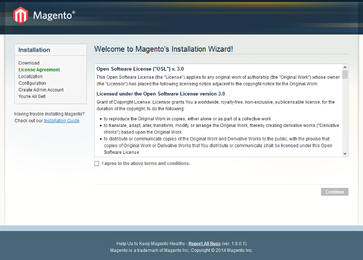
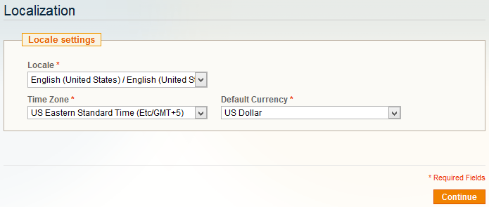
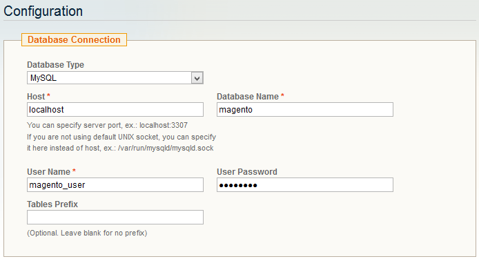
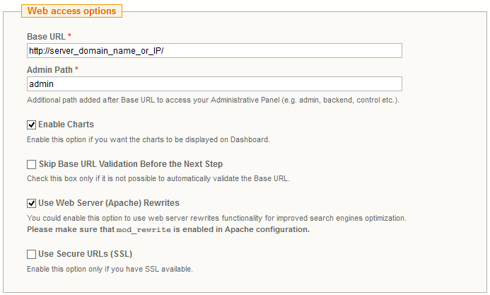
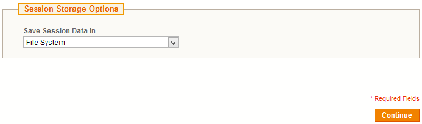
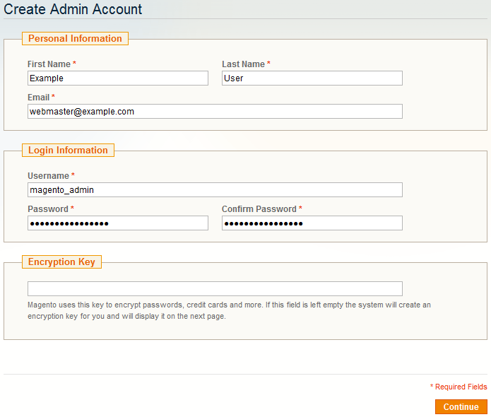
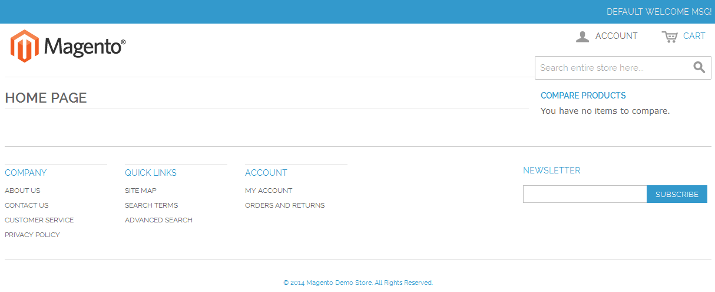
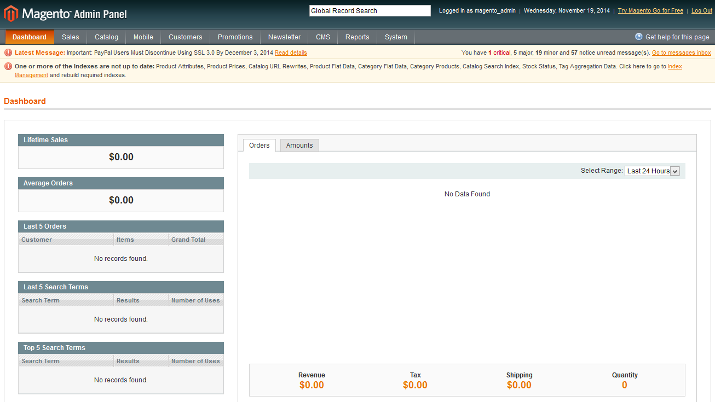

#How to Install and Configure Magento on Ubuntu 14.04

## Introduction

Magento is the most popular content management system for e-commerce websites. It is used by small businesses and large enterprise companies alike, and can be enhanced by thousands of extensions and themes. Magento uses the MySQL database system, the PHP programming language, and parts of the Zend Framework.

In this tutorial, we will go over how to install Magento with an Apache web server on Ubuntu 14.04, including some common performance and security configurations along the way.

## Prerequisites
Before you begin with this guide, there are a few steps that need to be completed first.

Due to the demands of processing Magento operations, it is recommended that you install Magento on a **VPS** with at least **2 GB** of **RAM**. This will ensure that all of the software involved in managing the store will have enough memory to work.

You will need access to a non-root user that has `sudo` privileges. If you haven't done this yet, you can run through the [Ubuntu 14.04 initial server setup guide](https://www.digitalocean.com/community/tutorials/initial-server-setup-with-ubuntu-14-04) to create this account.

Additionally, you'll need to have a **LAMP (Linux, Apache, MySQL, and PHP)** stack installed on your VPS instance. If you don't have these components already installed and configured, you can use this guide to learn [how to install LAMP](https://www.digitalocean.com/community/tutorials/how-to-install-linux-apache-mysql-php-lamp-stack-on-ubuntu-14-04) on Ubuntu 14.04.

When you are finished with these steps, you can connect to your Ubuntu server as your non-root user and continue with your Magento installation.

## Step 1 — Configure Apache and PHP
Before we download and install `Magento, Apache and PHP` need to be configured to properly handle Magento's traffic and computing tasks, and some additional modules will need to be installed and activated.

### Apache Virtual Host

First, we need to configure a virtual host file so that Apache knows how to manage our Magento site correctly. We can use our text editor to create a new virtual host file in `/etc/apache2/sites-available/`. In this example, the virtual host is called `magento`, but you can name it something else if you prefer.

	sudo nano /etc/apache2/sites-available/magento.conf
Magento's virtual host needs are fairly simple. Begin with a `<VirtualHost>` tag that listens for all traffic from port 80, the standard HTTP port. Then add a line telling Apache where to find your site's files with the `DocumentRoot` directive:

	<VirtualHost *:80>
	    DocumentRoot /var/www/html
	</VirtualHost>
We need to add some additional parameters for Magento to work properly. Inside of a `<Directory>` tag pointing to our document root, we'll enter the options for Apache's directory indexing, symlink support, and multilingual support. We'll also add a line that allows `.htaccess` files to override Apache settings, which provides more fine-grained control of individual folders.

	. . .
	    <Directory /var/www/html/>
	        Options Indexes FollowSymLinks MultiViews
	        AllowOverride All
	    </Directory>
	. . .
With all of these components in place, your virtual host file will look like this:

	<VirtualHost *:80>
	    DocumentRoot /var/www/html
	    <Directory /var/www/html/>
	        Options Indexes FollowSymLinks MultiViews
	        AllowOverride All
	    </Directory>
	</VirtualHost>
When you're finished writing up the server block, save and close the file. To enable the new site with Apache, use the `a2ensite` command:

	sudo a2ensite magento.conf
We also want to disable the default virtual host that came with Apache, as it will conflict with our new virtual host. To disable a site with Apache, use the `a2dissite` command:

	sudo a2dissite 000-default.conf

### PHP Settings

Next, we need to change how much memory Apache grants to PHP processes. Magento uses PHP for nearly everything it does, and needs a decent amount of memory for complex operations like indexing products and categories. By default, PHP allocates a maximum of 128MB of memory to each script running on Apache. We should bump that limit up to a reasonable amount to ensure that none of Magento's scripts run out of memory, which would cause the script to crash.

Open Apache's PHP configuration file with your text editor and root privileges:

	sudo nano /etc/php5/apache2/php.ini
Find the following line, which declares the memory limit per PHP script:

	memory_limit = 128M
Change that line so that the limit is raised to 512MB. Your store's memory needs may be higher depending on the number of products in your catalog and the number of visitors you receive daily. Some larger stores need to set their memory limit to 2GB or more, but 512MB should be adequate for now.

	memory_limit = 512M
**Note**: Be sure to use "M" at the end of the memory number.

When you are finished making this change, save and close the file. The next time that you restart Apache, the memory limit change will take effect.

Magento needs a couple of PHP modules in addition to the ones that come with PHP. We can get these directly from Ubuntu's default repositories after we update our local package index:

	sudo apt-get update
	sudo apt-get install libcurl3 php5-curl php5-gd php5-mcrypt
These extensions will allow Magento to properly handle HTTP requests, image thumbnails, and data encryption. Now that we have all of the packages that we need, we can enable URL rewriting support for Apache and encryption support for PHP:

	sudo a2enmod rewrite
	sudo php5enmod mcrypt
Once all of these configuration and extension changes have been made, it's time to restart the Apache server instance so that the changes are applied:

	sudo service apache2 restart
	
## Step 2 — Create a MySQL Database and User
Magento uses a MySQL database to manage site data, like product and order information. We have MySQL installed and configured, but we need to make a database and a user for Magento to work with.

Begin by logging into the MySQL root account:

	mysql -u root -p
You will be prompted for MySQL's root account password, which you set when you installed MySQL. Once the correct password has been submitted, you will be given a MySQL command prompt.

First, we'll create a database that Magento can write data to. In this example, the database will be called <mark>magento</mark>, but you can name it whatever you prefer.

	CREATE DATABASE magento;
**Note**: Every MySQL statement must end in a semi-colon (`;`), so check to make sure that you included that if you are running into any issues.

Next, we are going to create a new MySQL user account that will be used exclusively to operate on the new database. Creating one-function databases and accounts is a good idea, as it allows for better control of permissions and other security needs.

I am going to call the new account <mark>magento_user</mark> and will assign it a password of <mark>password</mark>. You should definitely use a different username and password, as these examples are not very secure.

	CREATE USER magento_user@localhost IDENTIFIED BY 'password';
At this point, you have a database and a user account that are each specifically made for Magento. However, the user has no access rights to the database. We need to link the two components together by granting our user access privileges to the database:

	GRANT ALL PRIVILEGES ON magento.* TO magento_user@localhost IDENTIFIED BY 'password';
Now that the user has access to the database, we need to flush the privileges so that MySQL knows about the recent privilege changes that we've made. Once that is done, we can exit out of the MySQL command prompt.

	FLUSH PRIVILEGES;
	exit
You should now be back to your regular SSH command prompt.

## Step 3 — Download and Set Up Magento Files
We are now ready to download and install Magento. To see what the latest stable version of the Magento Community Edition is, head over to the [community download page](http://www.magentocommerce.com/download). In this example, the current release number was 1.9.0.1, but you should substitute that number for the latest release available to you. It is always recommended to use the latest version of Magento, as new releases often include important security updates in addition to new and improved features.

Use `wget` to download the Magento file archive to your home directory:

	cd ~
	wget http://www.magentocommerce.com/downloads/assets/1.9.0.1/magento-1.9.0.1.tar.gz
We can extract the archived files to rebuild the Magento directory with `tar`:

	tar xzvf magento-1.9.0.1.tar.gz
You will now have a directory called `magento` in your home directory. We'll need to move the unpacked files to Apache's document root, where it can be served to visitors of our website. We will use `rsync` to transfer our Magento files there, since `rsync` will include important hidden files like `.htaccess`. Once the transfer is complete, we can clean up our home directory by deleting the `magento` folder and archive there.

	sudo rsync -avP ~/magento/. /var/www/html/
	rm -rf ~/magento*
`rsync` will safely copy all of the contents from the directory that you unpacked to the document root at `/var/www/html/`. Now we need to assign ownership of the files and folders to Apache's user and group:

	sudo chown -R www-data:www-data /var/www/html/
This change will allow Apache to create and modify Magento files. We are now ready to complete the installation process via Magento's browser-based configuration interface.

## Step 4 — Completing Installation Through the Web Interface
To access the web interface with your browser, navigate to your server's domain name or public IP address:

	http://server_domain_name_or_IP/
If the previous steps have been followed correctly, you will be presented with Magento's installation wizard. The first page will display the license agreement, which you will need to agree to before you can hit **Continue**.

The next page is where you can change your locale settings, like language, time zone, and currency. Change these to the settings most appropriate to where your products are being sold, then hit **Continue**.

The Configuration page is broken down into three sections. The first section is where you can set up how Magento connects to its MySQL database. Make sure that **Database Type** is set to "MySQL" and **Host** is set to "localhost". You'll then need to fill in **Database Name**, **User Name**, and **User Password** with the settings that you decided on when creating the MySQL database and user account earlier.

The next section on the Configuration page is where you can configure your store's URL, along with a couple of other Apache-controlled functions. Make sure that **Base URL** matches your server's domain name; if you don't have a domain name set up yet, you can use your server's public IP address for now. It's a good idea to change the **Admin Path** to something less obvious than "admin" to make it more difficult for someone to find your admin panel. You should also consider checking **Use Web Server (Apache) Rewrites** to make your site's URLs more friendly to users and search engines. The Apache module needed to support this functionality, `mod_rewrite`, has already been enabled and is ready for use.

The last part of the Configuration page is for selecting the method of session data storage. Magento ships with two methods of saving user session data. The **File System** method stores sessions in files on the server and is the simplest method to start with. The **Database** method stores sessions as entries in the MySQL database and is ideal for Magento installations that span across multiple servers. For now, we can stick with the **File System** method, since it will generally perform better out of the box.

After you select your configuration options and hit **Continue**, you'll move on to the admin account creation page. This is where you will create the administrative account that is in charge of maintaining the Magento store. Make sure that the username and password are both secure and difficult to guess. The **Encryption Key** field should be left blank unless you are migrating data over from an existing Magento installation. If you leave the field blank, Magento will generate a new encryption key when you click **Continue** and will display it for you on the next page. Make sure that you save that encryption key somewhere safe in case you need it for migration purposes later.

Once you have completed the web-based configuration, your Magento installation will be ready to use. Check out your new storefront by visiting your server's domain name or public IP address in your web browser:

	http://server_domain_name_or_IP/
If everything was configured correctly, you should be presented with a storefront that looks something like this:

You can also visit your new admin site by going to the admin directory that you set previously:

	http://server_domain_name_or_IP/admin/
Log in with your admin username and password to see your new dashboard:

## Conclusion
Now that you have your Magento store up and running, you are ready to begin building your project catalog and start selling!

A critical next step to take it to encrypt your site traffic with an SSL certificate. Here is a guide to help you get started: [How To Install an SSL Certificate from a Commercial Certificate Authority](https://www.digitalocean.com/community/tutorials/how-to-install-an-ssl-certificate-from-a-commercial-certificate-authority).